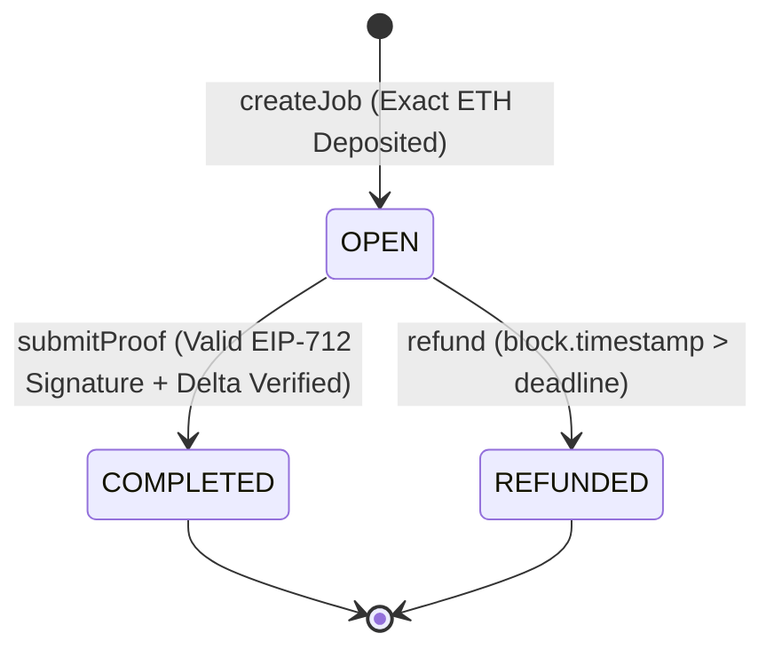

# MachineMandi Security & Threat Model

This document outlines the security architecture, smart contract safeguards, threat model, and explicit limitations of the `MachineMandi` protocol.

---

## 1. Escrow Lifecycle & State Machine

Every task in MachineMandi follows an immutable escrow state machine designed to protect buyer capital and guarantee payment upon verified machine performance:



- **OPEN (0)**: Funds are locked in escrow. Payouts and refunds are prohibited while the deadline has not passed and proof has not been submitted.
- **COMPLETED (1)**: Terminal state. Triggered by a cryptographically valid `submitProof`. Escrow is transferred to the node payout wallet. No further proofs or refunds can ever be executed on this job.
- **REFUNDED (2)**: Terminal state. Triggered by `refund` when `block.timestamp > deadline`. Escrow is returned to the buyer. No further proof submissions or double refunds are possible.

---

## 2. Replay Prevention & Binding

MachineMandi incorporates multi-layered replay and cross-job reuse prevention:

1. **Terminal State Locking**: Once a job transitions from `OPEN` to `COMPLETED` or `REFUNDED`, the state is permanent. Re-submitting the same proof reverts immediately with `JobNotOpen`.
2. **Unique Job IDs and Nonces**: Every job created increments a global monotonic counter (`jobCount`), assigning a unique `jobId` and `nonce`.
3. **Cryptographic Binding**: The signed `WorkProof` payload embeds `jobId`, `nodeId`, `nonce`, and `serviceHash`. A signature generated for Job 1 cannot be submitted for Job 2:
   - If the caller supplies Job 2's parameters with Job 1's signature, ECDSA recovery recovers an invalid address, reverting with `InvalidSigner`.
   - If the caller attempts to pass Job 1's nonce for Job 2, the contract reverts with `InvalidNonce`.

---

## 3. Domain Separation (Cross-Chain & Cross-Contract Protection)

Signatures are strictly bound to a single deployment using the standard EIP-712 domain separator:

```text
EIP712Domain(string name,string version,uint256 chainId,address verifyingContract)
```

- **Cross-Chain Protection**: The runtime `chainId` is hashed into the domain separator. A signature recorded on one network (e.g., testnet or a hard fork) cannot be replayed on mainnet or another chain.
- **Cross-Contract Protection**: The `verifyingContract` is bound to `address(this)`. Deploying a new contract instance invalidates all signatures signed for previous deployments.

---

## 4. Access Control & Protocol Administration

- **Owner-Only Administration**: Node registration (`registerNode`) and node deactivation (`deactivateNode`) are strictly restricted to the contract `owner` via the `onlyOwner` modifier.
- **Public / Permissionless Settlement**: Calling `submitProof` and `refund` is permissionless. Anyone (relayers, keepers, buyers, node operators) can execute settlement, but the contract strictly enforces:
  - Funds only ever go to `job.payout` (on completion) or `job.buyer` (on refund).
  - Payouts only execute if signed by the registered `node.signer`.

---

## 5. Job Snapshot Integrity

When a buyer creates and funds a job in `createJob`, the contract takes a **point-in-time snapshot** of the target node's terms:
- `signer`
- `payout`
- `serviceHash`
- `minDelta`

**Security Benefit**: The protocol prevents retrospective term changes. If an administrator deactivates a node or updates off-chain terms after a job is funded, the already-funded job will still settle according to the exact rules, payout address, and signing key agreed upon at creation time.

---

## 6. Deadline & Refund Rules

- **Future Deadline Requirement**: Deadlines must be strictly in the future (`deadline > block.timestamp`).
- **Maximum Deadline Duration**: Deadlines cannot exceed `MAX_DEADLINE_DURATION` (30 days from creation), preventing buyer funds from being indefinitely trapped in escrow.
- **Pre-Deadline Protection**: While `block.timestamp <= job.deadline`, calls to `refund(jobId)` revert with `DeadlineNotPassed`.
- **Post-Deadline Expiration**: Once `block.timestamp > job.deadline`, proof submission reverts with `DeadlineExpired`. Escrow can be safely reclaimed via `refund(jobId)`.

---

## 7. Checks-Effects-Interactions & Reentrancy Protection

All functions that transfer native Ether (`submitProof` and `refund`) implement strict security patterns:

1. **Checks-Effects-Interactions (CEI)**:
   - State variables (`job.status = STATUS_COMPLETED` or `STATUS_REFUNDED`, `job.preValue`, `job.postValue`) are updated **before** any external transfer call (`payable(...).call{value: amount}("")`).
2. **ReentrancyGuard**:
   - `submitProof`, `createJob`, and `refund` are protected by OpenZeppelin's `nonReentrant` modifier, stopping reentrancy attacks at the EVM execution level.
3. **Failed Payout Reversion**:
   - If the destination payout wallet is a contract that reverts on ETH receipt or runs out of gas, the entire transaction reverts (`TransferFailed`). The job status rolls back to `STATUS_OPEN`, preserving escrowed funds in the contract so capital is neither lost nor falsely marked as paid.

---

## 8. Relayer Threat Model & Boundaries

MachineMandi uses off-chain relayers to submit hardware proofs on-chain. The security boundaries are defined as follows:

| Relayer Capability | Can Relayer Do This? | Reason |
| :--- | :---: | :--- |
| Submit valid device proof | ✅ | Normal operation |
| Delay or censor submission | ✅ | Relayer controls its own RPC transactions |
| Forge an invalid proof | ❌ | Relayer does not hold the device's hardware private key |
| Alter telemetry readings | ❌ | Altering `preReading`/`postReading` breaks the signature hash (`InvalidSigner`) |
| Steal escrowed funds | ❌ | Funds are transferred directly to `job.payout`, not the relayer |

> **Censorship Mitigation:** If a relayer censors or fails to broadcast a device's proof, the transaction will not settle before the deadline. Once expired, the buyer can safely trigger `refund(jobId)` to recover their deposit.

---

## 9. Honest Protocol Limitations

Smart contracts can enforce cryptographic and financial rules, but cannot independently inspect the physical world. Integrators and operators must recognize the following unresolved boundaries:

1. **Sensor Spoofing & Physical Tampering**: The smart contract verifies that a registered device signed a reading, but cannot detect if physical sensors (e.g., flow meters, temperature probes) were mechanically bypassed, spoofed with analog simulators, or artificially stimulated.
2. **Device Private Key Extraction**: If the physical device lacks a hardware Secure Element (e.g., ATECC608A) or is physically captured by an adversary who extracts the private key, the attacker can sign arbitrary valid work proofs.
3. **Physical Delivery Verification**: The contract cannot verify whether water actually flowed through a physical pump or 3D filament was physically extruded—it only verifies the signed delta reported by the device firmware.
4. **Firmware Integrity**: The smart contract does not attest to the operating system or firmware version of the machine; it assumes the signing key is only utilized by untampered firmware.
5. **Hardware Availability**: The protocol cannot force an offline, malfunctioning, or unpowered machine to execute work. In such cases, the protocol relies on deadline expiration and buyer refunds.
